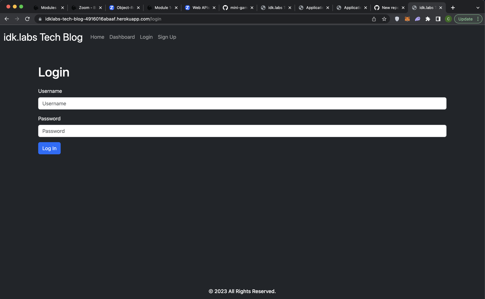

# MVC-tech-blog

## Description
This app is a simple blog app that allows you to create and delete blog posts as well as create and delete comments on each individual blog.

## Technologies Used

JavaScript  
Node.js  
Inquirer.js  
mysql2  

## Installation

No installation needed, just click link.

## Usage

To use this app you must first go to the sign up page and create an account. After your account is created, you are able to create a blog entry. You may also comment on and delete your blog entry.

## Screenshots

## Deployed app link

https://idklabs-tech-blog-4916016abaaf.herokuapp.com/